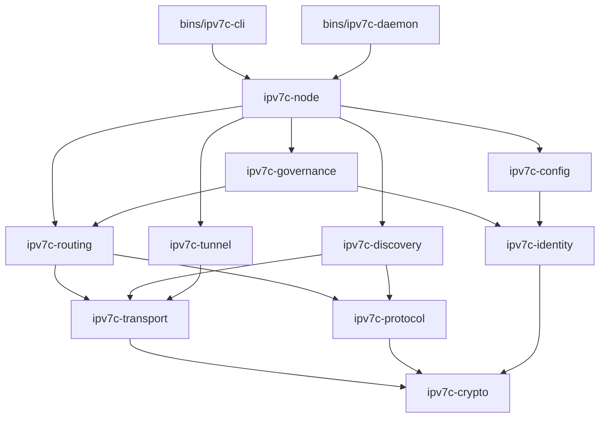

# IPv7C — Architecture Document

> **Version:** 1.0.0-dev  
> **Last Updated:** 2026-05-17  

---

## 1. Design Philosophy

IPv7C is a **100% Rust** sovereign mesh VPN. The architecture follows three non-negotiable principles:

1. **Sovereignty**: No central server, no cloud dependency, no accounts. Every node is autonomous.
2. **Modularity**: The system is decomposed into independent crates, each with a single responsibility. No crate exceeds 1,500 lines.
3. **Zero-Config**: A new node generates its identity, discovers peers, and establishes tunnels without any user configuration.

---

## 2. Crate Dependency Graph



---

## 3. Crate Responsibilities

### `ipv7c-crypto`
The cryptographic foundation. No other crate performs raw cryptographic operations.

- **ChaCha20-Poly1305** AEAD for session encryption
- **X25519** Diffie-Hellman for classical key exchange
- **ML-KEM-768** (NIST FIPS 203) for post-quantum key encapsulation
- **Noise Protocol** (IK pattern) for forward-secret handshakes
- **HKDF-SHA256** for key derivation
- **Ed25519** for signing (used by identity)

### `ipv7c-identity`
Manages node identity and multi-profile support.

- Generates Ed25519 keypairs → derives DID (`did:ipv7c:<base58_pubkey>`)
- Encrypted wallet store (SQLite + ChaCha20) for key persistence
- Multi-profile management: each profile has its own keypair, alias, and configuration
- Human-readable alias generation from pubkey hash
- Identity export/import for backup and device migration

### `ipv7c-transport`
Low-level network I/O. All socket operations live here.

- Async UDP sockets (tokio)
- UDP hole-punching with STUN binding requests
- TCP fallback for symmetric NAT environments
- QUIC transport (via `quinn`) for ordered, reliable streams
- Connection multiplexing over a single socket
- Keepalive heartbeats (1-byte UDP every 25s)
- Per-peer rate limiting (token bucket)
- Transport metrics: RTT, jitter, packet loss

### `ipv7c-routing`
Dynamic route management and data relay.

- Route table with composite scoring (latency + trust + hop count)
- Gossip protocol for route announcement (epidemic propagation with TTL)
- Multi-hop relay for peers without direct connectivity
- Intelligent path selection
- Route expiration and garbage collection
- Anti-loop protection (TTL decrement + seen-packet set)
- Persistent route storage (SQLite)

### `ipv7c-tunnel`
Virtual network interface for IP packet capture.

- **Windows**: Wintun adapter via `wintun` crate
- **Linux/macOS**: TUN device via `tun2` crate
- Async IP packet read/write with tokio
- Configurable MTU (default: 1400)
- DNS interception for sovereign name resolution
- Split tunneling support (route-based)

### `ipv7c-discovery`
Zero-config peer discovery across all network scopes.

- **LAN**: mDNS/DNS-SD (`_ipv7c._udp.local`)
- **WAN**: Kademlia DHT (custom implementation)
- **Mesh**: PEX (Peer Exchange) — peers share their known peers
- **Bootstrap**: Hardcoded seed nodes for initial DHT entry
- **Proximity**: BLE beacon discovery (mobile platforms)
- **Offline**: Wi-Fi Direct P2P discovery
- STUN/TURN server auto-discovery

### `ipv7c-protocol`
Binary wire format and handshake state machine.

- Fixed-size binary header (no JSON on the wire)
- Frame types: `DATA`, `CONTROL`, `GOSSIP`, `PUNCH`, `HEARTBEAT`, `HANDSHAKE`
- 3-way handshake FSM: `INIT → CHALLENGE → CONFIRM`
- Protocol version field for forward compatibility
- Optional zstd compression for large payloads
- Packet fragmentation and reassembly for frames exceeding MTU

### `ipv7c-governance`
Decentralized network self-regulation.

- Per-peer trust score based on: uptime, relay quality, latency consistency
- Automatic penalty for misbehavior: packet drops, spam, route manipulation
- Distributed ban list via lightweight consensus
- Temporal reputation decay for inactive nodes
- Future: parameter voting for network-wide configuration changes

### `ipv7c-config`
Auto-configuration and platform detection.

- Network environment detection: LAN, NAT type (cone/symmetric), CGNAT
- Intelligent defaults based on detected hardware and network
- TOML configuration file at `~/.ipv7c/config.toml` for optional overrides
- Auto-selection of transport: UDP → QUIC → TCP based on availability
- First-run experience: generate identity, select profile, start immediately
- Platform detection: Windows / Linux / macOS / Android / iOS

### `ipv7c-node`
The orchestrator that assembles all crates into a running node.

- Node lifecycle state machine: `Init → Discovering → Connecting → Meshed → Shutdown`
- Internal event bus (tokio broadcast channels) for inter-subsystem communication
- Graceful shutdown: announce departure to mesh, persist state
- Subsystem health watchdog
- Optional local REST API for GUI consumption (`/api/status`, `/api/peers`, `/api/routes`)
- Prometheus-compatible metrics export

---

## 4. Data Flow

### Outbound Packet (App → Mesh)

```
┌─────────┐     ┌──────────┐     ┌────────────┐     ┌──────────────┐     ┌─────────────┐
│   App   │────►│  Tunnel   │────►│  Routing   │────►│  Protocol    │────►│  Transport  │
│ (IP pkt)│     │ (TUN read)│     │ (next hop) │     │ (frame+enc)  │     │ (UDP send)  │
└─────────┘     └──────────┘     └────────────┘     └──────────────┘     └─────────────┘
```

### Inbound Packet (Mesh → App)

```
┌─────────────┐     ┌──────────────┐     ┌────────────┐     ┌──────────┐     ┌─────────┐
│  Transport  │────►│  Protocol    │────►│  Routing   │────►│  Tunnel   │────►│   App   │
│ (UDP recv)  │     │ (dec+verify) │     │ (for me?)  │     │ (TUN write)│    │ (IP pkt)│
└─────────────┘     └──────────────┘     └────────────┘     └──────────┘     └─────────┘
```

### Relay Packet (Mesh → Mesh)

```
┌─────────────┐     ┌──────────────┐     ┌────────────┐     ┌──────────────┐     ┌─────────────┐
│  Transport  │────►│  Protocol    │────►│  Routing   │────►│  Protocol    │────►│  Transport  │
│ (UDP recv)  │     │ (dec header) │     │ (relay hop)│     │ (re-frame)   │     │ (UDP send)  │
└─────────────┘     └──────────────┘     └────────────┘     └──────────────┘     └─────────────┘
```

---

## 5. Wire Protocol Format

```
 0                   1                   2                   3
 0 1 2 3 4 5 6 7 8 9 0 1 2 3 4 5 6 7 8 9 0 1 2 3 4 5 6 7 8 9 0 1
+-+-+-+-+-+-+-+-+-+-+-+-+-+-+-+-+-+-+-+-+-+-+-+-+-+-+-+-+-+-+-+-+
|  Version (4)  |  Type (4)     |         Payload Length (16)   |
+-+-+-+-+-+-+-+-+-+-+-+-+-+-+-+-+-+-+-+-+-+-+-+-+-+-+-+-+-+-+-+-+
|                        Sequence Number (32)                   |
+-+-+-+-+-+-+-+-+-+-+-+-+-+-+-+-+-+-+-+-+-+-+-+-+-+-+-+-+-+-+-+-+
|    TTL (8)    |  Flags (8)    |       Fragment Info (16)      |
+-+-+-+-+-+-+-+-+-+-+-+-+-+-+-+-+-+-+-+-+-+-+-+-+-+-+-+-+-+-+-+-+
|                     Source DID Hash (32)                      |
+-+-+-+-+-+-+-+-+-+-+-+-+-+-+-+-+-+-+-+-+-+-+-+-+-+-+-+-+-+-+-+-+
|                   Destination DID Hash (32)                   |
+-+-+-+-+-+-+-+-+-+-+-+-+-+-+-+-+-+-+-+-+-+-+-+-+-+-+-+-+-+-+-+-+
|                         Nonce (96)                            |
|                                                               |
|                                                               |
+-+-+-+-+-+-+-+-+-+-+-+-+-+-+-+-+-+-+-+-+-+-+-+-+-+-+-+-+-+-+-+-+
|                                                               |
|                    Encrypted Payload (variable)               |
|                                                               |
+-+-+-+-+-+-+-+-+-+-+-+-+-+-+-+-+-+-+-+-+-+-+-+-+-+-+-+-+-+-+-+-+
|                    AEAD Tag (128 bits)                        |
|                                                               |
+-+-+-+-+-+-+-+-+-+-+-+-+-+-+-+-+-+-+-+-+-+-+-+-+-+-+-+-+-+-+-+-+
```

**Frame Types:**
| Value | Type | Description |
|---|---|---|
| `0x01` | `DATA` | Encrypted IP packet payload |
| `0x02` | `CONTROL` | Node control messages |
| `0x03` | `GOSSIP` | Route announcements |
| `0x04` | `PUNCH` | UDP hole-punching signals |
| `0x05` | `HEARTBEAT` | Keepalive (1 byte payload) |
| `0x06` | `HANDSHAKE` | Noise protocol handshake messages |
| `0x07` | `GOVERNANCE` | Trust updates, ban proposals |

---

## 6. Security Model

### Threat Model
- **Passive eavesdropper**: Defeated by ChaCha20-Poly1305 AEAD on all data frames.
- **Active MITM**: Defeated by Noise IK handshake with pre-shared public keys.
- **Quantum adversary**: Mitigated by hybrid X25519 + ML-KEM-768 key exchange.
- **Sybil attack**: Mitigated by trust scoring and reputation decay.
- **Route poisoning**: Mitigated by signed route announcements (Ed25519).
- **Replay attack**: Defeated by sequence numbers and nonce uniqueness.

### Key Rotation
Session keys are automatically rotated every **10 minutes** or every **1 GB** of data transferred, whichever comes first. Rotation uses a new Noise handshake with fresh ephemeral keys.

---

## 7. Platform Adaptation

| Platform | Tunnel | Transport | Discovery | Binary Size Target |
|---|---|---|---|---|
| Windows | Wintun | UDP+TCP | mDNS+DHT | < 8 MB |
| Linux | `/dev/net/tun` | UDP+TCP+QUIC | mDNS+DHT | < 5 MB |
| macOS | `utun` | UDP+TCP | mDNS+DHT | < 6 MB |
| Android | `VpnService` | UDP+TCP | mDNS+DHT+BLE | < 4 MB (.so) |
| iOS | `NetworkExtension` | UDP+TCP | mDNS+DHT+BLE | < 4 MB (.a) |
| OpenWrt | Raw socket | UDP | DHT only | < 2 MB |
| ESP32 | N/A (relay) | UDP+BLE | BLE only | < 512 KB |
